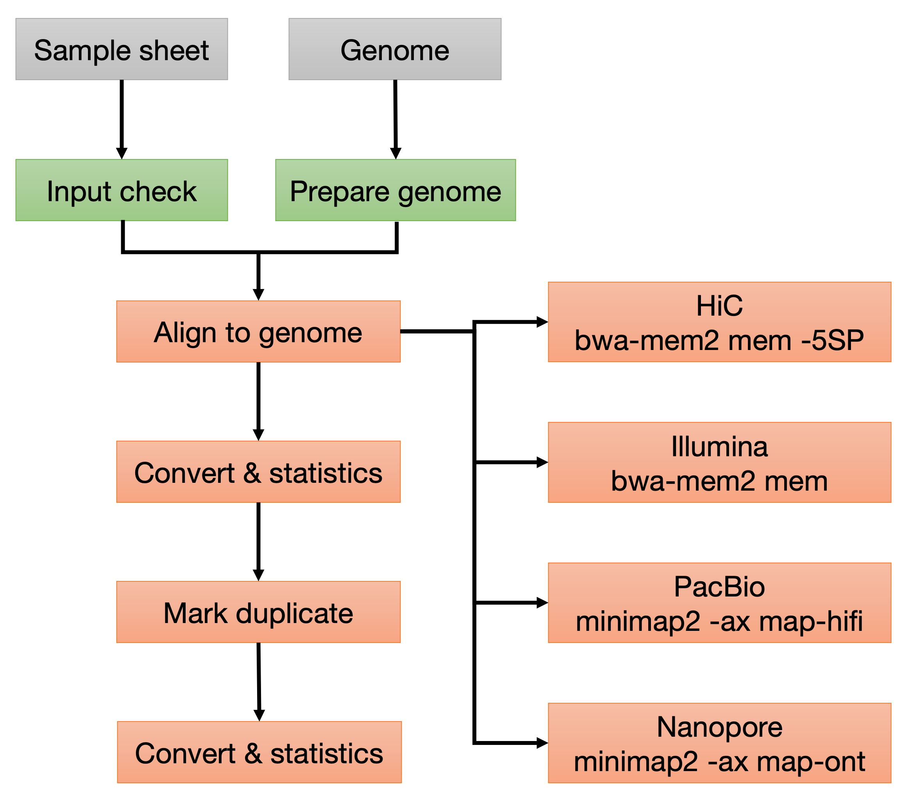

#  

[](https://github.com/sanger-tol/readmapping/actions?query=workflow%3A%22sanger-tol+CI%22)
[](https://github.com/sanger-tol/readmapping/actions?query=workflow%3A%22sanger-tol+linting%22)
<!-- [](https://nf-co.re/readmapping/results) -->
[](https://doi.org/10.5281/zenodo.6563578)

[](https://www.nextflow.io/)
[](https://docs.conda.io/en/latest/)
[](https://www.docker.com/)
[](https://sylabs.io/docs/)

[](https://SangerTreeofLife.slack.com/channels/pipelines)
[](https://twitter.com/sangertol)
[](https://www.youtube.com/channel/UCFeDpvjU58SA9V0ycRXejhA)

## Introduction

**sanger-core/readmapping** is a bioinformatics best-practice analysis pipeline written in Nextflow DSL2 for mapping reads generated using Illumina, HiC, PacBio and Nanopore technologies against a genome assembly. This pipeline is part of the Tree of Life production suite..

The pipeline is built using [Nextflow](https://www.nextflow.io), a workflow tool to run tasks across multiple compute infrastructures in a very portable manner. It uses Docker/Singularity containers making installation trivial and results highly reproducible. The [Nextflow DSL2](https://www.nextflow.io/docs/latest/dsl2.html) implementation of this pipeline uses one container per process which makes it much easier to maintain and update software dependencies. Where possible, these processes have been submitted to and installed from [nf-core/modules](https://github.com/nf-core/modules) in order to make them available to all nf-core pipelines, and to everyone within the Nextflow community!

On release, tests run the pipeline on a full-sized dataset on the Wellcome Sanger Institute HPC farm with Sigularity containers. This ensures that the pipeline runs, has sensible resource allocation defaults set to run on real-world datasets, and permits the persistent storage of results to benchmark between pipeline releases and other analysis sources. The results obtained from the full-sized test can be viewed on the [sanger-tol website](https://github.com/sanger-tol/readmapping/wiki/Results).

## Pipeline summary

Subworkflow: Input check

1. Checks samplesheet

Subworkflow: Prepare genome

1. Uncompress genome
2. Create bwa-mem2 index ([bwa-mem2 index](https://github.com/bwa-mem2/bwa-mem2))
3. Create minimap2 index ([minimap2 index](https://github.com/lh3/minimap2))
4. Create samtools index ([samtools faidx](https://www.htslib.org/doc/samtools-faidx.html)]

Subworkflow: Align reads to genome

1. Alignment
    - HiC and Illumina
        - Convert CRAM to FASTQ ([Samtools fastq](https://www.htslib.org/doc/samtools-fasta.html))
        - Align reads to genome ([bwa-mem2 mem](https://github.com/bwa-mem2/bwa-mem2))
    - Nanopore
        - Align reads to genome ([minimap2](https://github.com/lh3/minimap2))
    - PacBio CLR and CCS
        - Convert BAM to FASTQ ([bam2fastx bam2fastq](https://github.com/PacificBiosciences/bam2fastx))
        - Align reads to genome ([minimap2](https://github.com/lh3/minimap2))
2. Sort aligned files ([Samtools sort](https://www.htslib.org/doc/samtools-sort.html))
3. Merge all aligned BAMs and mark duplicates (Markduplicate subworkflow)
4. Convert merged and mark duplicated BAM to CRAM and calculate statistics (Convert and statistics subworkflow)

Subworkflow: Convert and statistics

1. Convert BAM to CRAM ([Samtools view](https://www.htslib.org/doc/samtools-view.html))
2. Index CRAM file ([Samtools index](https://www.htslib.org/doc/samtools-index.html))
3. Calculate statistics for all alignments ([Samtools stats](https://www.htslib.org/doc/samtools-stats.html))
4. Calculate statistics for primary alignments ([Samtools stats](https://www.htslib.org/doc/samtools-stats.html))
5. Calculate statistics based on flag values ([Samtools flagstat](https://www.htslib.org/doc/samtools-flagstat.html))
6. Calculate index statistics ([Samtools idxstats](https://www.htslib.org/doc/samtools-idxstats.html))

Subworkflow: Markduplicate

1. Merge position sorted bam files ([Samtools merge](https://www.htslib.org/doc/samtools-merge.html))
2. Collate merged BAM file ([Samtools collate](https://www.htslib.org/doc/samtools-collate.html))
3. Fill in mate coordinates and insert size fields ([Samtools fixmate](https://www.htslib.org/doc/samtools-fixmate.html))
4. Position sort BAM file ([Samtools sort](https://www.htslib.org/doc/samtools-sort.html))
5. Mark duplicates ([Samtools markdup](https://www.htslib.org/doc/samtools-markdup.html))

**Workflow**
</br>


## Quick Start

1. Install [`Nextflow`](https://www.nextflow.io/docs/latest/getstarted.html#installation) (`>=22.04.0`)

2. Install any of [`Docker`](https://docs.docker.com/engine/installation/), [`Singularity`](https://www.sylabs.io/guides/3.0/user-guide/), [`Podman`](https://podman.io/), [`Shifter`](https://nersc.gitlab.io/development/shifter/how-to-use/) or [`Charliecloud`](https://hpc.github.io/charliecloud/) for full pipeline reproducibility _(please only use [`Conda`](https://conda.io/miniconda.html) as a last resort; see [docs](https://nf-co.re/usage/configuration#basic-configuration-profiles))_

3. Download the pipeline and test it on a minimal dataset with a single command:

    ```console
    nextflow run sanger-tol/readmapping -profile test,YOURPROFILE
    ```

    Note that some form of configuration will be needed so that Nextflow knows how to fetch the required software. This is usually done in the form of a config profile (`YOURPROFILE` in the example command above). You can chain multiple config profiles in a comma-separated string.

    > - The pipeline comes with config profiles called `docker`, `singularity`, `podman`, `shifter`, `charliecloud` and `conda` which instruct the pipeline to use the named tool for software management. For example, `-profile test,docker`.
    > - Please check [nf-core/configs](https://github.com/nf-core/configs#documentation) to see if a custom config file to run nf-core pipelines already exists for your Institute. If so, you can simply use `-profile <institute>` in your command. This will enable either `docker` or `singularity` and set the appropriate execution settings for your local compute environment.
    > - If you are using `singularity`, please use the [`nf-core download`](https://nf-co.re/tools/#downloading-pipelines-for-offline-use) command to download images first, before running the pipeline. Setting the [`NXF_SINGULARITY_CACHEDIR` or `singularity.cacheDir`](https://www.nextflow.io/docs/latest/singularity.html?#singularity-docker-hub) Nextflow options enables you to store and re-use the images from a central location for future pipeline runs.
    > - If you are using `conda`, it is highly recommended to use the [`NXF_CONDA_CACHEDIR` or `conda.cacheDir`](https://www.nextflow.io/docs/latest/conda.html) settings to store the environments in a central location for future pipeline runs.

4. Start running your own analysis!

    ```console
    nextflow run sanger-tol/readmapping -profile <docker/singularity/podman/shifter/charliecloud/conda/institute> --input samplesheet.csv --fasta genome.fa.gz
    ```

## Documentation

The sanger-tol/readmapping pipeline comes with documentation about the pipeline [usage](docs/usage.md) and [output](docs/output.md).

## Credits

sanger-tol/readmapping was originally written by @priyanka-surana.

We thank the following people for their extensive assistance in the development of this pipeline:

## Contributions and Support

If you would like to contribute to this pipeline, please see the [contributing guidelines](.github/CONTRIBUTING.md).

For further information or help, don't hesitate to get in touch on the [Slack `#pipelines` channel](https://sangertreeoflife.slack.com/channels/pipelines). Please [create an issue](https://github.com/sanger-tol/readmapping/issues/new/choose) on GitHub if you are not on the Sanger slack channel.

## Citations

If you use  sanger-tol/readmapping for your analysis, please cite it using the following doi: [10.5281/zenodo.6563578](https://doi.org/10.5281/zenodo.6563578)

An extensive list of references for the tools used by the pipeline can be found in the [`CITATIONS.md`](CITATIONS.md) file.

You can cite the `nf-core` publication as follows:

> **The nf-core framework for community-curated bioinformatics pipelines.**
>
> Philip Ewels, Alexander Peltzer, Sven Fillinger, Harshil Patel, Johannes Alneberg, Andreas Wilm, Maxime Ulysse Garcia, Paolo Di Tommaso & Sven Nahnsen.
>
> _Nat Biotechnol._ 2020 Feb 13. doi: [10.1038/s41587-020-0439-x](https://dx.doi.org/10.1038/s41587-020-0439-x).
